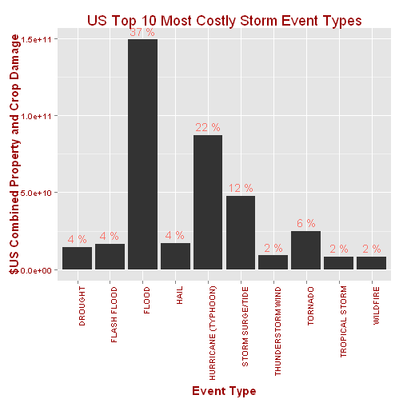
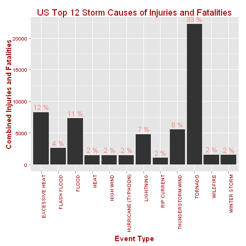

Health and Economic Impact of Major Storm Events in the USA: 1996 to 2011
========================================================
Allison Miller
July 2014


# Synopsis
This project involves exploring the U.S. National Oceanic and Atmospheric Administration's (NOAA) storm database. This database tracks characteristics of major storms and weather events in the United States, including when and where they occur, as well as estimates of any fatalities, injuries, and property damage. The NOAA has maintained this database of storm events since 1950. This analysis will investigate the costs (both in dollar terms and human terms) of these storm events. Although the data goes as far back as 1950, it wasn't until 1996 that the NOAA created a list of standardised events.  Events previous to 1996 were classed into fewer types, and even after 1996 many reports of storm events did not stick to the official list of events.  For the purposes of this analysis, we will stick to the more coherent event list from 1996 onwards to build a picture of the most common causes of storm related costs.

#Data Processing

The data can be downloaded from https://d396qusza40orc.cloudfront.net/repdata%2Fdata%2FStormData.csv.bz2 and then read into R:  Initially we will read in just the first line and header of the file to get a feel for the data structure:

```r
url = "https://d396qusza40orc.cloudfront.net/repdata%2Fdata%2FStormData.csv.bz2"
StormData = "./StormData.csv.bz2"
if (!file.exists(StormData)) {
    download.file(url, StormData)
}
stormData=read.csv("StormData.csv.bz2", header=T, nrow=1)
```
Let's look at the structure of the data in more detail:

```r
str(stormData)
```

```
## 'data.frame':	1 obs. of  37 variables:
##  $ STATE__   : num 1
##  $ BGN_DATE  : Factor w/ 1 level "4/18/1950 0:00:00": 1
##  $ BGN_TIME  : int 130
##  $ TIME_ZONE : Factor w/ 1 level "CST": 1
##  $ COUNTY    : num 97
##  $ COUNTYNAME: Factor w/ 1 level "MOBILE": 1
##  $ STATE     : Factor w/ 1 level "AL": 1
##  $ EVTYPE    : Factor w/ 1 level "TORNADO": 1
##  $ BGN_RANGE : num 0
##  $ BGN_AZI   : logi NA
##  $ BGN_LOCATI: logi NA
##  $ END_DATE  : logi NA
##  $ END_TIME  : logi NA
##  $ COUNTY_END: num 0
##  $ COUNTYENDN: logi NA
##  $ END_RANGE : num 0
##  $ END_AZI   : logi NA
##  $ END_LOCATI: logi NA
##  $ LENGTH    : num 14
##  $ WIDTH     : num 100
##  $ F         : int 3
##  $ MAG       : num 0
##  $ FATALITIES: num 0
##  $ INJURIES  : num 15
##  $ PROPDMG   : num 25
##  $ PROPDMGEXP: Factor w/ 1 level "K": 1
##  $ CROPDMG   : num 0
##  $ CROPDMGEXP: logi NA
##  $ WFO       : logi NA
##  $ STATEOFFIC: logi NA
##  $ ZONENAMES : logi NA
##  $ LATITUDE  : num 3040
##  $ LONGITUDE : num 8812
##  $ LATITUDE_E: num 3051
##  $ LONGITUDE_: num 8806
##  $ REMARKS   : logi NA
##  $ REFNUM    : num 1
```
For this analysis, we are only interested in the following:

BGN_DATE (Date of beginning of storm, currently a factor)   
STATE (State abbreviation as a factor)  
EVTYPE (Type of event, currently a factor, make it a character)  
FATALITIES (Number of fatalities, numeric)  
INJURIES (number of injuries, numeric)  
PROPDMG (Property damage, numeric, needs adjusting with PROPDMGEXP to get actual cost)  
PROPDMGEXP (Abbreviation, make into character, telling us how much to multiply the PROPDMG variable by to get actual cost)  
CROPDMG (Crop damage, numeric, needs adjusting with CROPDMGEXP to get actual cost)  
CROPDMGEXP (Abbreviation, make into charatcer, telling us how much to multiply the CROPDMG variable by to get actual cost)  
REFNUM (Number unique for each event, numeric)  

Detailed information about all the variables can be found here:  
http://ire.org/media/uploads/files/datalibrary/samplefiles/Storm%20Events/storms.xls

The main ducumentaion can be found here:  
http://ire.org/media/uploads/files/datalibrary/samplefiles/Storm%20Events/readme_08.doc

So let's read all rows of the data in, ignoring variables that we are not interested in, while changing the remaining variables to suit the analysis:

```r
stormData=read.csv("StormData.csv.bz2", header = TRUE, colClasses = c("NULL", "character", "NULL", "NULL", "NULL", "NULL", "character", "character", "NULL", "NULL", "NULL", "NULL", "NULL", "NULL", "NULL", "NULL", "NULL", "NULL", "NULL", "NULL", "NULL", "NULL", "numeric", "numeric", "numeric", "character", "numeric", "character", "NULL", "NULL", "NULL", "numeric", "numeric", "NULL", "NULL", "NULL", "numeric"), nrows=902297, comment.char="")
```

Check the data to make sure we have it right:

```r
str(stormData)
```

```
## 'data.frame':	902297 obs. of  12 variables:
##  $ BGN_DATE  : chr  "4/18/1950 0:00:00" "4/18/1950 0:00:00" "2/20/1951 0:00:00" "6/8/1951 0:00:00" ...
##  $ STATE     : chr  "AL" "AL" "AL" "AL" ...
##  $ EVTYPE    : chr  "TORNADO" "TORNADO" "TORNADO" "TORNADO" ...
##  $ FATALITIES: num  0 0 0 0 0 0 0 0 1 0 ...
##  $ INJURIES  : num  15 0 2 2 2 6 1 0 14 0 ...
##  $ PROPDMG   : num  25 2.5 25 2.5 2.5 2.5 2.5 2.5 25 25 ...
##  $ PROPDMGEXP: chr  "K" "K" "K" "K" ...
##  $ CROPDMG   : num  0 0 0 0 0 0 0 0 0 0 ...
##  $ CROPDMGEXP: chr  "" "" "" "" ...
##  $ LATITUDE  : num  3040 3042 3340 3458 3412 ...
##  $ LONGITUDE : num  8812 8755 8742 8626 8642 ...
##  $ REFNUM    : num  1 2 3 4 5 6 7 8 9 10 ...
```
Now let's do our first filtering to look only at events that have happened since 1996, First we set the BGN_DATE field to date format, then filter by year:

```r
stormData$BGN_DATE=as.Date(stormData$BGN_DATE, format = "%m/%d/%Y")
after1995 = stormData[(stormData$BGN_DATE >= "1996-01-01"), ]
```
Now that we have all the variables we need for the years we are interested, we will remove the stormData file to free up memory for the rest of the analysis.  From here on we'll just use the after1995 data set:

```r
remove(stormData)
dim(after1995)
```

```
## [1] 653530     12
```
This leaves us with 653530 events after 1995 to work with.  

# Processing data to look at economic costs

We are interested in both economic and human costs of storm events.  We'll deal with the economic costs first, then the human costs.

The economic costs of storm events are captured by two different measures in our after1995 data. These are property damage and crop damage.  To get the actual dollars of damage for each category, it is necessary to combine a column with a numeric indicator and multiply that by a factor given in a separate column.  Multipliers are found in the PROPDMGEXP for property damage (PROPDMG) and CROPDMGEXP for crop damage (CROPDMG).  These multipliers are as follows:

```r
unique(after1995$PROPDMGEXP)
```

```
## [1] "K" ""  "M" "B" "0"
```

```r
unique(after1995$CROPDMGEXP)
```

```
## [1] "K" ""  "M" "B"
```
According to the documentation of this dataset, "K" means thousand US dollars or 1e+03, "M" means million US dollars, or 1e+06, and "B" means billion US dollars, or 1e+09.  So we will create a variable to convert these characters to their numeric dollar value as follows:


```r
multiplier = c(0, 1e+03, 1e+06, 1e+09)
multiplierCharacter = c("", "K", "M", "B")
```
We will use this multiplier to create two new variables in our after1995 data set that will contain the correct number to multiply the PROPDMG and CROPDMG variables by:

```r
after1995$propDamage = multiplier[match(after1995$PROPDMGEXP, multiplierCharacter)]
after1995$cropDamage = multiplier[match(after1995$CROPDMGEXP, multiplierCharacter)]
```
Now we can actually caluclate the total dollar values of damage to property and crops separately:


```r
after1995$totalPropDamage <- after1995$PROPDMG * after1995$propDamage
after1995$totalCropDamage <- after1995$CROPDMG * after1995$cropDamage
```

For the purposes of this analysis, we will only look at the total costs to property and crops, by adding the two together into the variable we will use for the rest of this analysis (CombinedCost):


```r
after1995$CombinedCost=after1995$totalPropDamage + after1995$totalCropDamage
```
As an exploratory look, let's see what the total cost of storm events to property and crops since 1996 is (after removing anything tha is not applicable, NA):

```r
sum(after1995$CombinedCost, na.rm=T)
```

```
## [1] 4.015e+11
```
That's over 400 billion US dollars!
Let's look at costs by event type to see what the most costly type of events are:


```r
aggDamages=aggregate(CombinedCost~EVTYPE, data=after1995, sum)
str(aggDamages)
```

```
## 'data.frame':	516 obs. of  2 variables:
##  $ EVTYPE      : chr  "   HIGH SURF ADVISORY" " COASTAL FLOOD" " FLASH FLOOD" " LIGHTNING" ...
##  $ CombinedCost: num  200000 0 50000 0 8100000 8000 0 0 0 0 ...
```
As we can see, there are over 500 event types in the data.  There are only 48 officially recognised event types, so we will need to do a bit of cleaning of the data before we can make any conclusions.

We'll first look at the top 50 events, to see how many of them match the official list, as well as to see how much of the 400 billion dollars in damage they capture.  First, sort the CombinedCost column from highest to lowest:

```r
Damages=aggDamages[order(aggDamages$CombinedCost, decreasing=T),]
```
Then take the top 50 most costly and find out the sum:

```r
DamagesTop50=Damages[1:50,]
sum(DamagesTop50$CombinedCost)
```

```
## [1] 4.013e+11
```
What percent of the total cost do these top 50 events capture?

```r
sum(DamagesTop50$CombinedCost)/sum(Damages$CombinedCost)
```

```
## [1] 0.9995
```

Great, it looks like the top 50 events account for almost all of total damage costs from storm events.  


Now which of these 50 events are the most costly?  Let's look at what is in the DamagesTop50 event types after converting all characters to lower case:

```r
DamagesTop50$EVTYPE=tolower(DamagesTop50$EVTYPE)
```
The list of officially recognised events can be found on page 6 of this document:
https://d396qusza40orc.cloudfront.net/repdata%2Fpeer2_doc%2Fpd01016005curr.pdf

I have copied these events into a .csv file and saved it to my working directory as EVTYPE.csv, and included a header "EVTYPE".  Now I will read this document into R as "legitEvtype", again converting to lower case:

```r
legitEvtype=read.csv("EVTYPE.csv", header=T)
legitEvtype$EVTYPE=tolower(legitEvtype$EVTYPE)
```
Let's see how many of these match our data:

```r
DamagesTop50$matched=(DamagesTop50$EVTYPE%in% legitEvtype$EVTYPE)
table(DamagesTop50$EVTYPE, DamagesTop50$matched)
```

```
##                            
##                             FALSE TRUE
##   agricultural freeze           1    0
##   blizzard                      0    1
##   coastal  flooding/erosion     1    0
##   coastal flood                 0    2
##   coastal flooding              1    0
##   coastal flooding/erosion      1    0
##   damaging freeze               1    0
##   drought                       0    1
##   early frost                   1    0
##   erosion/cstl flood            1    0
##   excessive heat                0    1
##   extreme cold                  2    0
##   extreme windchill             1    0
##   flash flood                   0    1
##   flood                         0    1
##   freeze                        1    0
##   frost/freeze                  0    1
##   hail                          0    1
##   heavy rain                    0    1
##   heavy rain/high surf          1    0
##   heavy snow                    0    1
##   high surf                     0    1
##   high wind                     0    1
##   hurricane                     1    0
##   hurricane/typhoon             1    0
##   ice storm                     0    1
##   lake-effect snow              0    1
##   landslide                     1    0
##   lightning                     0    1
##   river flood                   1    0
##   river flooding                1    0
##   small hail                    1    0
##   storm surge                   1    0
##   storm surge/tide              0    1
##   strong wind                   0    1
##   thunderstorm wind             0    1
##   tornado                       0    1
##   tropical storm                0    1
##   tstm wind                     1    0
##   tstm wind/hail                1    0
##   tsunami                       0    1
##   typhoon                       1    0
##   unseasonably cold             1    0
##   urban/sml stream fld          1    0
##   wild/forest fire              1    0
##   wildfire                      0    1
##   winter storm                  0    1
##   winter weather                0    1
```
The categories where FALSE is greater than 0 are one's that we will need to manually edit to match the official list, as best we can.  Here is my event mapping strategy:

*"agricultural freeze","damaging freeze", "freeze" and "early frost" will become "frost/freeze"  
*"coastal  flooding/erosion", "coastal flooding","coastal flooding/erosion", and "erosion/cstl flood" will all become "coastal flood"  
*"extreme cold" and "extreme windchill" will become "extreme cold/wind chill"  
*"heavy rain/high surf" will become "heavy rain"  
*"hurricane", "hurricane/typhoon" and "typhoon" will become "hurricane (typhoon)"  
*"landslide" will become "debris flow"  
*"river flood", "urban/sml stream fld" and "river flooding" will become "flood"  
*"small hail" will become "hail"  
*"storm surge" will become "storm surge/tide"  
*"tstm wind" and "tstm wind/hail" will become "thunderstorm wind"  
*"unseasonably cold" will become "cold/wind chill"  
*"wild/forest fire" will become "wildfire"  

Phew, that's a lot of data cleaning.  Here is the code:


```r
library(plyr)
DamagesTop50$EVTYPE=mapvalues(DamagesTop50$EVTYPE, from = c("agricultural freeze","damaging freeze", "freeze", "early frost"), to = c("frost/freeze", "frost/freeze", "frost/freeze", "frost/freeze"))
DamagesTop50$EVTYPE=mapvalues(DamagesTop50$EVTYPE, from = c("coastal  flooding/erosion", "coastal flooding","coastal flooding/erosion", "erosion/cstl flood"), to = c("coastal flood", "coastal flood", "coastal flood","coastal flood"))
DamagesTop50$EVTYPE=mapvalues(DamagesTop50$EVTYPE, from = c("extreme cold" , "extreme windchill"), to = c("extreme cold/wind chill","extreme cold/wind chill"))
DamagesTop50$EVTYPE=mapvalues(DamagesTop50$EVTYPE, from = c("heavy rain/high surf"), to = c("high surf"))
DamagesTop50$EVTYPE=mapvalues(DamagesTop50$EVTYPE, from = c("hurricane", "hurricane/typhoon","typhoon"), to = c("hurricane (typhoon)", "hurricane (typhoon)", "hurricane (typhoon)"))
DamagesTop50$EVTYPE=mapvalues(DamagesTop50$EVTYPE, from = c("landslide"), to = c("debris flow"))
DamagesTop50$EVTYPE=mapvalues(DamagesTop50$EVTYPE, from = c("river flood", "urban/sml stream fld", "river flooding"), to = c("flood", "flood","flood"))
DamagesTop50$EVTYPE=mapvalues(DamagesTop50$EVTYPE, from = c("small hail"), to = c("hail"))
DamagesTop50$EVTYPE=mapvalues(DamagesTop50$EVTYPE, from = c("storm surge"), to = c("storm surge/tide"))
DamagesTop50$EVTYPE=mapvalues(DamagesTop50$EVTYPE, from = c("tstm wind", "tstm wind/hail"), to = c("thunderstorm wind","thunderstorm wind"))
DamagesTop50$EVTYPE=mapvalues(DamagesTop50$EVTYPE, from = c("unseasonably cold"), to = c("cold/wind chill"))
DamagesTop50$EVTYPE=mapvalues(DamagesTop50$EVTYPE, from = c("wild/forest fire"), to = c("wildfire"))
```

Let's check to see if all the replacements match the official event types:


```r
DamagesTop50$matched=(DamagesTop50$EVTYPE%in% legitEvtype$EVTYPE)
table(DamagesTop50$EVTYPE, DamagesTop50$matched)
```

```
##                          
##                           TRUE
##   blizzard                   1
##   coastal flood              6
##   cold/wind chill            1
##   debris flow                1
##   drought                    1
##   excessive heat             1
##   extreme cold/wind chill    3
##   flash flood                1
##   flood                      4
##   frost/freeze               5
##   hail                       2
##   heavy rain                 1
##   heavy snow                 1
##   high surf                  2
##   high wind                  1
##   hurricane (typhoon)        3
##   ice storm                  1
##   lake-effect snow           1
##   lightning                  1
##   storm surge/tide           2
##   strong wind                1
##   thunderstorm wind          3
##   tornado                    1
##   tropical storm             1
##   tsunami                    1
##   wildfire                   2
##   winter storm               1
##   winter weather             1
```

OK, so now all the event types match official categories, but we need to recalculate the cost per event type:

```r
correctAggDamage=aggregate(CombinedCost~EVTYPE, data=DamagesTop50, sum)
length(unique(correctAggDamage$EVTYPE))
```

```
## [1] 28
```
So we have narrowed down almost 100% of the damage costs from storm events to 28 types.

# Processing data to look at human costs

A completely different way to look at the costs of major storm events is to look at the human costs in terms of fatalities and injuries.  Both of these values are found in our after1995 data set, in the columns labeled "FATALITIES" and "INJURIES".  We will take a similar approach as we did for economic costs to work out which events cost the most in human terms.  For this, I will simply sum  the number of fatalities and injuries per event in a new column called InjFatalCombined:


```r
after1995$InjFatalCombined= after1995$FATALITIES + after1995$INJURIES
sum(after1995$InjFatalCombined)
```

```
## [1] 66707
```
This is the total number of injuries and fatalities from storm events since 1996

Now we'll aggregate them by event type and order them in decreasing order:

```r
aggInjFatal=aggregate(InjFatalCombined~EVTYPE, data=after1995, sum)
aggInjFatal=aggInjFatal[order(aggInjFatal$InjFatalCombined, decreasing=T),]
```
Again, we'll take a look at the top 50 events:

```r
InjFatalTop50=aggInjFatal[1:50,]
sum(InjFatalTop50$InjFatalCombined)
```

```
## [1] 66252
```
These top 50 events account for 66252 injuries and fatalities out of the total of 66707, which is over 99% of the total.  I will use the same list of official event types (legitEvtypes) to try and clean the data up.

```r
InjFatalTop50$EVTYPE=tolower(InjFatalTop50$EVTYPE)
InjFatalTop50$matched=(InjFatalTop50$EVTYPE%in% legitEvtype$EVTYPE)
table(InjFatalTop50$EVTYPE, InjFatalTop50$matched)
```

```
##                           
##                            FALSE TRUE
##   avalanche                    0    1
##   blizzard                     0    1
##   cold/wind chill              0    1
##   dense fog                    0    1
##   dry microburst               1    0
##   dust devil                   0    1
##   dust storm                   0    1
##   excessive heat               0    1
##   extreme cold                 1    0
##   extreme cold/wind chill      0    1
##   flash flood                  0    1
##   flood                        0    1
##   fog                          1    0
##   glaze                        1    0
##   hail                         0    1
##   heat                         0    1
##   heat wave                    1    0
##   heavy rain                   0    1
##   heavy snow                   0    1
##   heavy surf                   1    0
##   heavy surf/high surf         1    0
##   high surf                    0    1
##   high wind                    0    1
##   hurricane                    1    0
##   hurricane/typhoon            1    0
##   ice storm                    0    1
##   landslide                    1    0
##   lightning                    0    1
##   marine strong wind           0    1
##   marine thunderstorm wind     0    1
##   rip current                  0    1
##   rip currents                 1    0
##   snow squall                  1    0
##   storm surge                  1    0
##   strong wind                  0    1
##   thunderstorm wind            0    1
##   tornado                      0    1
##   tropical storm               0    1
##   tstm wind                    1    0
##   tstm wind/hail               1    0
##   tsunami                      0    1
##   urban/sml stream fld         1    0
##   wild/forest fire             1    0
##   wildfire                     0    1
##   wind                         1    0
##   winter storm                 0    1
##   winter weather               0    1
##   winter weather mix           1    0
##   winter weather/mix           1    0
##   wintry mix                   1    0
```
Using the same strategy as for the economic costs, I will map the unofficial events to the official events as follows:

*"dry microburst" and "wind" will become "high wind"  
*"extreme cold" will become "extreme cold/wind chill"  
*"fog" will become "dense fog"  
*"glaze" will become "frost/freeze"  
*"heat wave" will become "excessive heat"  
*"heavy surf" and "heavy surf/high surf" will become "high surf"  
*"hurricane" and "hurricane/typhoon" will become "hurricane (typhoon)"  
*"landslide" will become "debris flow"  
*"rip currents" will become "rip current"  
*"snow squall" will become "heavy snow"  
*"storm surge" will become "storm surge/tide"  
*"tstm wind" and "tstm wind/hail" will become "thunderstorm wind"  
*"urban/sml stream fld" will become "flood"  
*"wild/forest fire" will become "wildfire"  
*"winter weather mix", "winter weather/mix", and "wintry mix" will become "winter weather"  

Here's the code:

```r
InjFatalTop50$EVTYPE=mapvalues(InjFatalTop50$EVTYPE, from = c("dry microburst", "wind"), to = c("high wind", "high wind"))
InjFatalTop50$EVTYPE=mapvalues(InjFatalTop50$EVTYPE, from = c("extreme cold"), to = c("extreme cold/wind chill"))
InjFatalTop50$EVTYPE=mapvalues(InjFatalTop50$EVTYPE, from = c("fog"), to = c("dense fog"))
InjFatalTop50$EVTYPE=mapvalues(InjFatalTop50$EVTYPE, from = c("glaze"), to = c("frost/freeze"))
InjFatalTop50$EVTYPE=mapvalues(InjFatalTop50$EVTYPE, from = c("heat wave"), to = c("excessive heat"))
InjFatalTop50$EVTYPE=mapvalues(InjFatalTop50$EVTYPE, from = c("heavy surf","heavy surf/high surf"), to= c("high surf","high surf"))
InjFatalTop50$EVTYPE=mapvalues(InjFatalTop50$EVTYPE, from = c("hurricane","hurricane/typhoon"), to = c("hurricane (typhoon)","hurricane (typhoon)"))
InjFatalTop50$EVTYPE=mapvalues(InjFatalTop50$EVTYPE, from = c("landslide"), to = c("debris flow"))
InjFatalTop50$EVTYPE=mapvalues(InjFatalTop50$EVTYPE, from = c("rip currents"), to = c("rip current"))
InjFatalTop50$EVTYPE=mapvalues(InjFatalTop50$EVTYPE, from = c("snow squall"), to = c("heavy snow"))
InjFatalTop50$EVTYPE=mapvalues(InjFatalTop50$EVTYPE, from = c("storm surge"), to = c("storm surge/tide"))
InjFatalTop50$EVTYPE=mapvalues(InjFatalTop50$EVTYPE, from = c("tstm wind", "tstm wind/hail"), to = c("thunderstorm wind","thunderstorm wind"))
InjFatalTop50$EVTYPE=mapvalues(InjFatalTop50$EVTYPE, from = c("urban/sml stream fld"), to = c("flood"))
InjFatalTop50$EVTYPE=mapvalues(InjFatalTop50$EVTYPE, from = c("wild/forest fire"), to = c("wildfire"))
InjFatalTop50$EVTYPE=mapvalues(InjFatalTop50$EVTYPE, from = c("winter weather mix", "winter weather/mix", "wintry mix"), to = c("winter weather","winter weather","winter weather"))
```
Now re-check the validity of the evnt types:

```r
InjFatalTop50$matched=(InjFatalTop50$EVTYPE%in% legitEvtype$EVTYPE)
table(InjFatalTop50$EVTYPE, InjFatalTop50$matched)
```

```
##                           
##                            TRUE
##   avalanche                   1
##   blizzard                    1
##   cold/wind chill             1
##   debris flow                 1
##   dense fog                   2
##   dust devil                  1
##   dust storm                  1
##   excessive heat              2
##   extreme cold/wind chill     2
##   flash flood                 1
##   flood                       2
##   frost/freeze                1
##   hail                        1
##   heat                        1
##   heavy rain                  1
##   heavy snow                  2
##   high surf                   3
##   high wind                   3
##   hurricane (typhoon)         2
##   ice storm                   1
##   lightning                   1
##   marine strong wind          1
##   marine thunderstorm wind    1
##   rip current                 2
##   storm surge/tide            1
##   strong wind                 1
##   thunderstorm wind           3
##   tornado                     1
##   tropical storm              1
##   tsunami                     1
##   wildfire                    2
##   winter storm                1
##   winter weather              4
```

Once again, we need to re-calculate the injuries and fatalities by event type, since some of them have changed:

```r
correctAggInj=aggregate(InjFatalCombined~EVTYPE, data=InjFatalTop50, sum)
length(unique(correctAggInj$EVTYPE))
```

```
## [1] 33
```
This leaves us with 33 event types contributing to over 99% of injuries and fatalities.

# Results

In both the economic costs and human costs, there are still a lot of event types.  To narrow down our analysis, I will calculate the percent of costs or injuries/fatalities for each of the top 50 events.  I will then plot all those that contribute to 2% or more of the total.  This should give us a good idea of what the most costly events are.

For the economic impact, I will create a new variable called "percent" which will be derived from the correctAggDamage$CombinedCosts. First I will order them in decreasing order:


```r
correctAggDamage=correctAggDamage[order(correctAggDamage$CombinedCost, decreasing=T),]
correctAggDamage$percent=(round(correctAggDamage$CombinedCost/sum(correctAggDamage$CombinedCost),digits=2))*100
#Show which events contribute to at least 2% of total damage
which(correctAggDamage$percent>=2)
```

```
##  [1]  1  2  3  4  5  6  7  8  9 10
```
So it looks like the top 10 event types all contribute to at least 2% of total dollar costs of storm events. 

Let's consider how much of the total top 50 costs are associated with these 10 events.

```r
BiggestDamageEvents=correctAggDamage[1:10,]
sum(BiggestDamageEvents$CombinedCost)/sum(DamagesTop50$CombinedCost)
```

```
## [1] 0.9529
```
That's over 95%. Here are the top 10 most costly events:

```r
BiggestDamageEvents
```

```
##                 EVTYPE CombinedCost percent
## 9                flood    1.491e+11      37
## 16 hurricane (typhoon)    8.707e+10      22
## 20    storm surge/tide    4.784e+10      12
## 23             tornado    2.490e+10       6
## 11                hail    1.709e+10       4
## 8          flash flood    1.656e+10       4
## 5              drought    1.441e+10       4
## 22   thunderstorm wind    8.922e+09       2
## 24      tropical storm    8.320e+09       2
## 26            wildfire    8.163e+09       2
```


Let's plot all 10 of these events, showing damage in dollar values as well as percent of cost:


```r
library(ggplot2)
ggplot(data=BiggestDamageEvents, aes(y=CombinedCost,x=toupper(EVTYPE)))+
    geom_bar(stat="identity",  position=position_dodge())+
    theme(legend.position="none")+  
    labs(title="US Top 10 Most Costly Storm Event Types", x="Event Type", y="$US Combined Property and Crop Damage")+
    geom_text(aes(label=paste(percent,"%"), vjust=-.5, colour="#990000"))+
    theme(axis.title.x = element_text(face="bold", colour="#990000", size=15),
          axis.text.x  = element_text(angle=90, hjust=1, size=10, colour="#990000"),
          axis.title.y=element_text(face="bold", colour="#990000", size=15),
          axis.text.y = element_text(size=10, colour="#990000"),
          title=element_text(size=15, colour="#990000"))
```

 


Now let's look at the top events causing injuries or fatalities, by percentage:


```r
#Order them by decreasing first
correctAggInj=correctAggInj[order(correctAggInj$InjFatalCombined, decreasing=T),]
#Calculate percent of total
correctAggInj$percent=(round(correctAggInj$InjFatalCombined/sum(correctAggInj$InjFatalCombined),digits=2))*100
#Show us how many contribute 2% or higher
which(correctAggInj$percent>=2)
```

```
##  [1]  1  2  3  4  5  6  7  8  9 10 11 12
```
Thus, for injuries and fatalities, 12 event types contribute to 2% or more of injuries and fatalities.  Let's look at these top 12:

```r
BiggestInjFatalEvents=subset(correctAggInj[1:12,])
sum(BiggestInjFatalEvents$percent)
```

```
## [1] 87
```
Thus these top 12 event types contribute to 87% of all fatalities and injuries.  

```r
BiggestInjFatalEvents
```

```
##                 EVTYPE InjFatalCombined percent
## 28             tornado            22178      33
## 8       excessive heat             8258      12
## 11               flood             7279      11
## 27   thunderstorm wind             5500       8
## 21           lightning             4792       7
## 10         flash flood             2561       4
## 31            wildfire             1543       2
## 32        winter storm             1483       2
## 14                heat             1459       2
## 18           high wind             1448       2
## 19 hurricane (typhoon)             1446       2
## 24         rip current             1045       2
```


Let's plot these:


```r
ggplot(data=BiggestInjFatalEvents, aes(y=InjFatalCombined,x=toupper(EVTYPE)))+
    geom_bar(stat="identity",  position=position_dodge())+
    theme(legend.position="none")+  
    labs(title="US Top 12 Storm Causes of Injuries and Fatalities", x="Event Type", y="Combined Injuries and Fatalities")+
    geom_text(aes(label=paste(percent,"%"), vjust=-.5, colour="#990000"))+
    theme(axis.title.x = element_text(face="bold", colour="#990000", size=15),
          axis.text.x  = element_text(angle=90, hjust=1, size=10, colour="#990000"),
          axis.title.y=element_text(face="bold", colour="#990000", size=15),
          axis.text.y = element_text(size=10, colour="#990000"),
          title=element_text(size=15, colour="#990000"))
```

 
# Discussion

The justification for limiting this analysis to 1996 onwards come froms the NOAA database details here:
http://www.ncdc.noaa.gov/stormevents/details.jsp

Basically, only tornados were recorded from 1950 to 1954, and only tornandos, thunderstorm wind and hail events are recorded from 1955 through 1995.  So 1996 onwards seems to capture much more detailed data about the types of storm events (48 event types).

According to this analysis, The most economically costly types of storm events appears to be floods, hurricanes(typhoons) and storm surge/tides, followed by tornados, hail, flash floods, drought, thunderstorm winds, tropical storms and wildfires.

In terms of injuries and fatalities, tornados, excessive heat and floods are the most costly, with thunderstorm winds, lightning,	flash floods, wildfires, winter storms,	heat, high wind, hurricanes (typhoons) and rip currents also being significant sources of morbidity and mortality.  

However, it would be premature to try and draw any conclusions from this analysis. Though this analysis should have captured more than 99% of most of the recorded costs, injuries and fatalities, it is limited in many ways.  The coding of the events was often not followed rigourously, and some of the re-coding decisions used in the analysis may have been faulty. The data itself is very untidy, and there are no doubt many errors that have not been filtered out by this brief analysis. For instance, the wrong coding of even one crop or property damage exponent from a K or M to a B would throw out the entire analysis. Likewise some events may have been recorded more than once.  

It would also be interesting to look at a breakdown of economic costs by property damage versus crop damage, and likewise to compare fatalities to injuries when considering the human cost of these types of events.  Another thing that might be worth considering is to look at inflation adjusted figures in the economic analysis. Other ways worth looking at the data might be by year, especally if wanting to see climate change impacts. From a civil defence planning point of view, it would also be good to analyse the event types by region, as the types of storm events in any particular region may be heavily influenced by geography.  Local planning for storm events would ideally have data on the likelyhood of different types of events in a particular region. The original data set has categories to help with this kind of mapping to various degrees, such as state, county, longitude and latitude.


# Session information


```r
sessionInfo()
```

```
## R version 3.1.0 (2014-04-10)
## Platform: i386-w64-mingw32/i386 (32-bit)
## 
## locale:
## [1] LC_COLLATE=English_New Zealand.1252 
## [2] LC_CTYPE=English_New Zealand.1252   
## [3] LC_MONETARY=English_New Zealand.1252
## [4] LC_NUMERIC=C                        
## [5] LC_TIME=English_New Zealand.1252    
## 
## attached base packages:
## [1] stats     graphics  grDevices utils     datasets  methods   base     
## 
## other attached packages:
## [1] ggplot2_1.0.0 plyr_1.8.1    knitr_1.6    
## 
## loaded via a namespace (and not attached):
##  [1] colorspace_1.2-4 digest_0.6.4     evaluate_0.5.5   formatR_0.10    
##  [5] grid_3.1.0       gtable_0.1.2     labeling_0.2     MASS_7.3-33     
##  [9] munsell_0.4.2    proto_0.3-10     Rcpp_0.11.2      reshape2_1.4    
## [13] scales_0.2.4     stringr_0.6.2    tools_3.1.0
```
